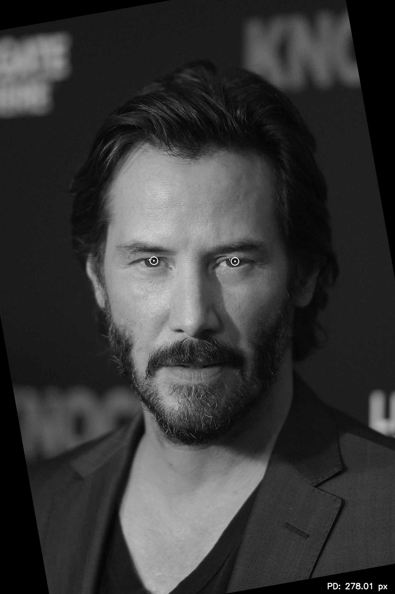
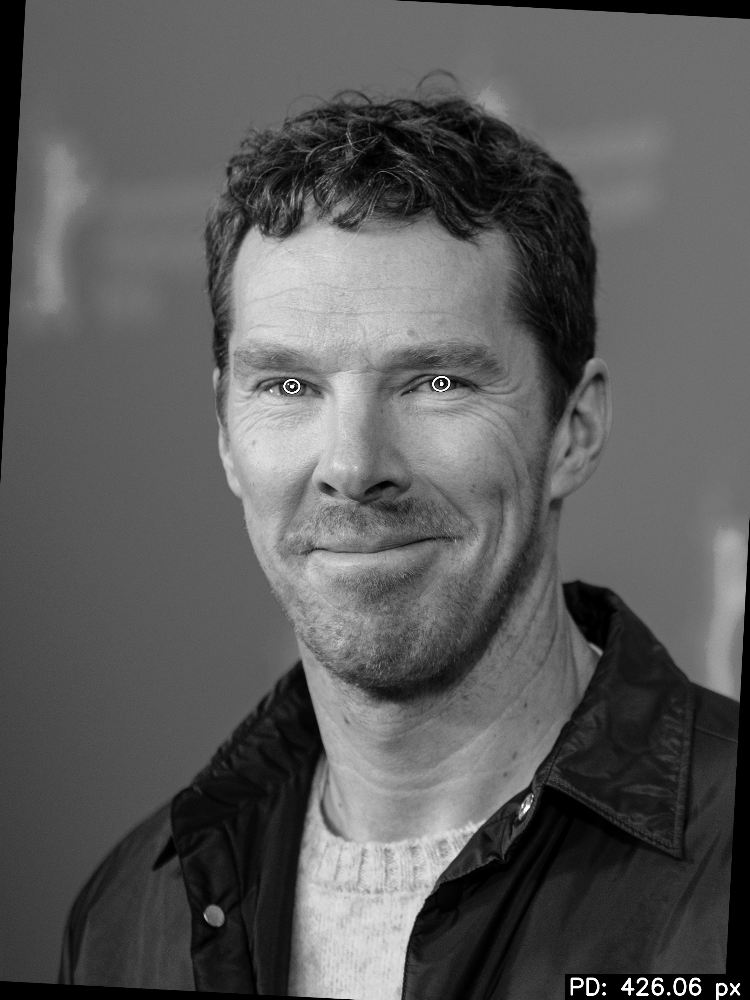

# pupil-distance-detector

使用傳統影像處理與 OpenCV 建立的瞳孔距離偵測專案。

目前專案提供兩條可用流程：
- `Pipeline V1`：以臉部 / 眼睛偵測為主的瞳孔搜尋流程
- `Pipeline V2`：以 reference points 與 perspective transform 為主的瞳孔搜尋流程

輸入圖片放在 [data/input](/c:/Users/GIGABYTE/Image%20processing/data/input)，
經過 pipeline 處理後的成果圖會輸出到 [data/output](/c:/Users/GIGABYTE/Image%20processing/data/output)。

## 專案結構

```text
pupil-distance-detector/
├─ data/
│  ├─ input/
│  ├─ output/
│  └─ samples/
├─ requirements.txt
├─ pyproject.toml
├─ README.md
├─ main.py
└─ src/
   └─ pupil_distance_detector/
      ├─ __init__.py
      ├─ main.py
      ├─ preprocessing/
      ├─ edge_detection/
      ├─ feature_detection/
      ├─ measurement/
      ├─ pipelines/
      │  ├─ base.py
      │  ├─ factory.py
      │  ├─ pipeline_v1.py
      │  ├─ pipeline_v2.py
      │  └─ pipeline_playground.py
      └─ utils/
```

## 安裝方式

### Windows `cmd`

```bat
python -m venv .venv
.\.venv\Scripts\activate.bat
python -m pip install --upgrade pip
pip install -r requirements.txt
pip install -e .
```

### 已有 `.venv`

```bat
.\.venv\Scripts\activate.bat
pip install -r requirements.txt
pip install -e .
```

## 套件需求

[requirements.txt](/c:/Users/GIGABYTE/Image%20processing/requirements.txt) 目前包含：
- `numpy`
- `opencv-python`
- `matplotlib`

安裝指令：

```bat
pip install -r requirements.txt
```

## 資料夾用途

- [data/input](/c:/Users/GIGABYTE/Image%20processing/data/input)
  放原始輸入圖片。

- [data/output](/c:/Users/GIGABYTE/Image%20processing/data/output)
  放 pipeline 處理後的成果圖。

- [data/samples](/c:/Users/GIGABYTE/Image%20processing/data/samples)
  放展示或測試用範例圖片。

## Pipeline V1

[pipeline_v1.py](/c:/Users/GIGABYTE/Image%20processing/src/pupil_distance_detector/pipelines/pipeline_v1.py)
主要流程：

1. 小角度旋轉搜尋
2. Haar cascade 偵測臉部與眼睛
3. 建立左右眼搜尋區域
4. Gaussian blur、adaptive threshold、Canny、Hough / contour 候選搜尋
5. 計算左右瞳孔中心與瞳孔距離
6. 輸出最終標註圖

執行範例：

```bat
python main.py --input data/input/1.jpg --output data/output/result_v1.jpg --pipeline v1
```

## Pipeline V2

[pipeline_v2.py](/c:/Users/GIGABYTE/Image%20processing/src/pupil_distance_detector/pipelines/pipeline_v2.py)
主要流程：

1. 小角度旋轉搜尋
2. Haar cascade 偵測臉部
3. 建立 reference points
4. 透過 perspective transform 拉正眼帶區域
5. 在左右眼 ROI 內做 gradient voting、dark-center refinement、radial profile 與 Hough 微調
6. 將瞳孔中心與輪廓反投影回原圖
7. 計算左右瞳孔中心距離並輸出成果圖

執行範例：

```bat
python main.py --input data/input/2.jpg --output data/output/result_v2.jpg --pipeline v2
```

## 主程式使用方式

```bat
python main.py --input <輸入圖片> --output <輸出圖片> --pipeline <v1|v2>
```

參數說明：
- `--input`：輸入圖片路徑
- `--output`：輸出成果圖片路徑
- `--pipeline`：選擇 `v1` 或 `v2`
- `--grayscale`：以灰階模式讀取輸入圖片

## 輸出內容

程式會輸出：
- 左瞳孔中心座標
- 右瞳孔中心座標
- 瞳孔中心距離 `PD`
- 標註後的成果圖片

成果圖片會存到你指定的 `--output` 路徑，通常建議放在 [data/output](/c:/Users/GIGABYTE/Image%20processing/data/output)。

## Sample

### Pipeline V1

輸出檔案：
[result_v1.jpg](/c:/Users/GIGABYTE/Image%20processing/data/output/result_v1.jpg)



### Pipeline V2

輸出檔案：
[result_v2.jpg](/c:/Users/GIGABYTE/Image%20processing/data/output/result_v2.jpg)


